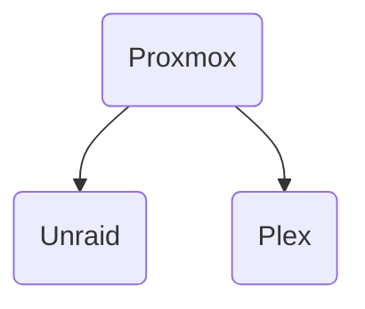

# Home Server with Proxmox VE as a Hypervisor and Virtualized Unraid for NAS

## Links
🔗 <a href="https://www.proxmox.com/en/">Proxmox</a> 
🔗 <a href="https://unraid.net/">Unraid</a> 
🔗 <a href="https://www.plex.tv/">Plex</a> 

## Introduction

I am currently running a **Plex Media Server** on one of my retired desktop PCs. The system is built around an **Intel i7-4790K** paired with an **ASRock H97M Pro4** motherboard, **16 GB of DDR3 RAM**, and an **AMD Radeon R9 200 Series GPU**.  
Storage consists of a **500 GB Samsung 870 EVO SSD** as the boot drive, along with a **10 TB HDD**, an **8 TB HDD**, and a **16 TB HDD**. The machine is currently running **Windows 10 Pro**.

When I initially set up this server, I wasn’t familiar with Linux or NAS-focused operating systems, so I opted for Windows as that is what I was familiar with and had a deep hatred for Linux. This setup originated back in **2022**, when Google announced that unlimited storage for student accounts would be discontinued. At the time, all my media was stored on my Google Drive (using my college account) and mounted as a virtual drive so Plex could access it.  

With unlimited Google Drive storage disappearing, I needed a quick local solution. I dusted off my unused desktop, attempted to install Linux, and quickly realized I had no idea what I was doing. I gave up and installed Windows, since my priority was simply to pull the data off the cloud to prevent any loss.  

Fast forward to now, it’s still running Windows, and I’ve been adding drives as needed. I’m not using any RAID configuration, so there’s currently **no redundancy**. To make things worse (or funnier), I misplaced the HDD mounting hardware years ago, so the drives are **literally sitting on top of a bundle of cables** at the bottom of the case. Despite that, I haven’t had any drive failures or lost data yet - which honestly feels miraculous.  

I’m now planning a major upgrade to this setup for both performance and reliability reasons. The new plan is to use **Proxmox Virtual Environment (VE)** as the hypervisor and run **Unraid** inside Proxmox to handle storage management. I’ll be adding an **HBA (Host Bus Adapter)** for direct passthrough to Unraid, giving me flexible and expandable storage capabilities.

## Why Virtualize Unraid Under Proxmox Instead of Running It Bare Metal?!

My reasoning is that I want this system to be **more than just a NAS and Plex server**. I’d like to run additional **virtual machines (VMs)** for various self-hosted services and development projects, with the goal of becoming less dependent on cloud services.  

While I could theoretically manage my storage directly through Proxmox, **Unraid offers key benefits** that align better with my goals:

- **Flexible storage scaling:** Unraid allows me to mix and match different drive sizes and expand over time without rebuilding arrays.  
- **Ease of use:** Its web interface and community support make managing large storage pools much simpler than configuring ZFS or LVM directly.  
- **Redundancy:** The single-parity system in Unraid provides a level of protection that’s sufficient for my use case, and I can add the parity drive later when needed.

By virtualizing Unraid within Proxmox, I get the **best of both worlds** - Unraid’s flexible storage management combined with Proxmox’s powerful virtualization and containerization capabilities. This setup will allow me to run Unraid for file storage and Plex, while also spinning up additional VMs for experimentation, automation, and local self-hosting.

## Why Unraid Instead of TrueNAS, Synology, Debian, or Other NAS Operating Systems

I chose **Unraid** primarily for the reasons mentioned earlier - flexibility, scalability, and simplicity. It allows me to use **different-sized hard drives**, **add more drives at any time**, and utilize a **single parity drive** for data protection. Setting this up on my own in say Debian would be possible but I like the ease of use and comforts of a specific NAS OS.

High-capacity HDDs are expensive, and I tend to purchase them only when needed, prioritizing the **lowest cost per terabyte** while still keeping reliability in mind. This means I **need** a system that lets me expand storage quickly and easily - and Unraid does exactly that.  

If I were to use something like **TrueNAS** (which relies on **ZFS**), expanding storage wouldn’t be nearly as simple. ZFS stores data in groups of drives called **vdevs**, which together form a **pool**. Once a vdev is created, you *cannot* add drives to it - you can only add a **new vdev** to the pool. However, the new vdev must contain **drives of the same size** to maintain balanced performance and redundancy. This effectively means that expanding storage often requires adding several new drives at once, which can get expensive quickly.  

Unraid, on the other hand, allows me to add a single new drive - of **any size** - to the existing array at any time. That’s a huge advantage for someone like me who upgrades incrementally instead of all at once.

### Unraid’s Parity Drive

Unraid uses one or two dedicated **parity drives** to provide data redundancy.  
The only requirement is that the parity drive must be **equal to or larger than** the largest data drive in the array.  

This setup is great because it lets me retain as much usable storage space as possible while still providing protection against a **single drive failure** (or two if dual parity is configured).  

The trade-off, of course, is that Unraid’s parity system is **not as robust as RAID-Z2 or RAID-Z3** (which can tolerate multiple simultaneous failures). However, given my luck so far, I’m comfortable with the single-parity setup.  

Unraid also offers **SMART monitoring**, **notifications**, and optional **scheduled parity checks**, which should help catch failing drives before a real issue occurs. So while I’m aware of the risks, I’m confident this strikes the right balance between protection, capacity, and flexibility for my use case.

---

### Comparison: Unraid vs TrueNAS vs Synology vs Debian

| Feature / Aspect | **Unraid** | **TrueNAS** | **Synology** | **Debian / DIY NAS** |
|------------------|-------------|--------------------|------------------|----------------------|
| **Storage Type** | Custom parity-based array | ZFS (vdevs & pools) | SHR (Synology Hybrid RAID) | User-defined (mdadm, LVM, ZFS, etc.) |
| **Mix Drive Sizes** | ✅ Yes, any size | ❌ No (same-size per vdev) | ⚠️ Partial (SHR allows some flexibility) | ⚙️ Depends on setup |
| **Add Drives Incrementally** | ✅ Yes, one at a time | ❌ No (must add full vdev) | ✅ Usually yes | ⚙️ Depends on configuration |
| **Redundancy** | Single or dual parity drives | RAID-Z1/Z2/Z3 | SHR-1/SHR-2 (similar to RAID 5/6) | Custom RAID or none |
| **Performance** | Moderate (not striped) | High (striped reads/writes) | Good (optimized for NAS workloads) | Varies widely |
| **Ease of Use** | Very user-friendly | Advanced, steep learning curve | Very user-friendly (GUI-based) | Manual setup required |
| **Data Protection** | Parity rebuild | Checksumming, self-healing | Checksumming, snapshot support | Depends on filesystem |
| **Best For** | Flexible home servers and mixed-drive setups | High-performance, enterprise-grade NAS | Plug-and-play NAS users | Advanced Linux users and DIY setups |

---

Unraid ultimately gives me the balance I’m looking for, **expandability, simplicity, and just enough redundancy** without locking me into strict storage rules or requiring large upfront investments in matching drives.

# Why Plex Instead of Jellyfin or Emby

The main reason I’m sticking with **Plex** is that I already own a **lifetime Plex Pass**. If I didn’t, I would definitely consider switching to **Jellyfin**, since it supports **hardware-accelerated transcoding** for free, something Plex locks behind the Plex Pass paywall.  

Another big factor is **device compatibility**. Both I and most of my Plex users primarily watch through **Smart TVs**, and Plex has **official native apps** on nearly every major TV platform, including LG webOS, Samsung Tizen, Roku, Android TV, and Apple TV.  

Meanwhile, **Jellyfin** and **Emby** are more limited in that area.  
- **Jellyfin** does have community-maintained Smart TV apps, such as for LG and Samsung, but they are not officially supported or as polished as Plex’s native clients.  
- **Emby** has broader official support than Jellyfin, including LG and Samsung, but its premium features such as **hardware transcoding**, **DVR**, and **offline sync** require a paid **Emby Premiere** subscription, similar to Plex Pass.  

Lastly, I’ve simply gotten used to the **Plex ecosystem**: its interface, metadata handling, and streaming behavior. At this point, switching would mean retraining myself and helping my users migrate and configure new apps on their TVs.  

So, while Jellyfin’s open-source and free model is appealing, Plex still wins for me in terms of **convenience, Smart TV support, and overall user experience**.

---

### Comparison: Plex vs Jellyfin vs Emby

| Feature / Aspect | **Plex** | **Jellyfin** | **Emby** |
|------------------|----------|--------------|-----------|
| **License** | Freemium (Plex Pass adds features) | Fully open-source (GPLv2) | Freemium (Emby Premiere adds features) |
| **Hardware Transcoding** | ✅ Plex Pass required | ✅ Free | ✅ Emby Premiere required |
| **Smart TV Apps** | ✅ Official on LG, Samsung, Roku, etc. | ⚠️ Community-maintained, unofficial | ✅ Official on most major platforms |
| **Metadata Handling** | Excellent, automatic | Good but manual tweaks often needed | Good, similar to Plex |
| **Offline Sync / Mobile Download** | ✅ Plex Pass feature | ⚙️ Manual or plugin-based | ✅ Emby Premiere feature |
| **DVR / Live TV** | ✅ Plex Pass feature | ⚙️ Plugin support (TVheadend, etc.) | ✅ Emby Premiere feature |
| **Ease of Setup** | Very easy | Moderate | Moderate |
| **Best For** | Users who want plug-and-play simplicity and polished clients | Open-source enthusiasts and tinkerers | Users who want a middle ground between Plex and Jellyfin |

---

Plex ultimately provides the **smoothest “it just works” experience**, while Jellyfin is great for users who value **open-source freedom and control**, and Emby fits neatly in between the two.

# Where to Run Plex

At this point, I have two main options for where to host **Plex**, and I am still deciding which setup makes the most sense. I can either run **Plex inside Unraid**, giving it direct access to my media drives, or I can **run Plex in Proxmox alongside Unraid** as a separate virtual machine, which would provide more control over resource allocation and isolation.

---

### Option 1: Running Plex Inside Unraid

Running Plex directly inside **Unraid** is the simplest approach. Unraid has excellent support for **Docker containers**, and the official Plex container can be installed easily.

**Pros:**
- **Direct access to media drives:** Plex reads files natively with no network overhead.  
- **Simpler setup:** Less configuration is required compared to setting up networking between Proxmox and Unraid.  
- **Single system to manage:** Unraid handles storage and Plex in one environment, reducing complexity.  

**Cons:**
- **Shared OS updates:** Plex will go down if Unraid reboots for updates.  
- **Less Configurability:** Unable to define specifc resources for Plex; Will have to share with Unraid
- **GPU Passthrough Challenges:** I’ve read that some people encounter issues when trying to pass their GPU to Plex for hardware acceleration.

---

### Option 2: Running Plex in Proxmox (Separate VM or LXC)

The alternative is to run Plex as its own **VM or LXC container inside Proxmox**, separate from Unraid. Plex would still access the media stored on Unraid via a **network share (NFS or SMB)**.

**Pros:**
- **Independent uptime:** Plex can stay running even if Unraid needs maintenance or reboots.  
- **Better resource isolation:** The VM can have a fixed amount of CPU and memory reserved, ensuring predictable performance.  
- **Future-proof:** Easier to migrate, snapshot, or scale Plex separately from the storage layer.  

**Cons:**
- **Slight network overhead:** Accessing media over NFS or SMB may introduce minimal latency compared to direct disk access.  
- **More setup required:** Initial configuration of the VM, networking, and access to Unraid shares requires more steps than running Plex directly in Unraid.  

---

### My Takeaway

Both options are valid. If I want the **simplest, minimal-configuration setup**, running Plex **inside Unraid** works well.  

If I want **independent uptime, better resource control, and more flexibility for future expansion**, running Plex **in Proxmox alongside Unraid** is the better long-term solution.  

Given my goals, I am leaning toward the **Proxmox VM setup**, as it separates Plex from the storage layer while still providing straightforward access to my media library.

